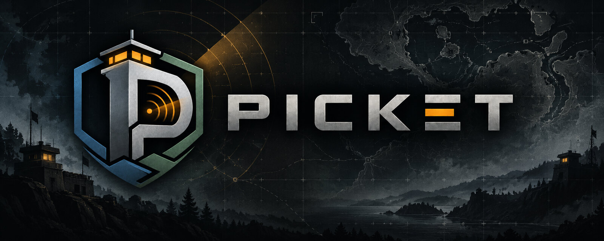
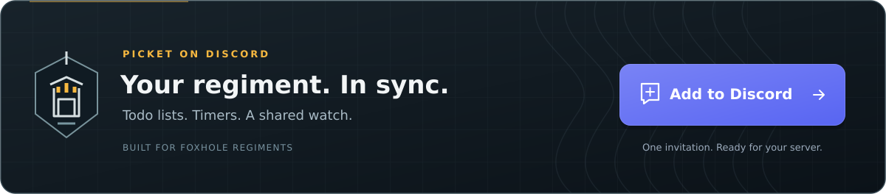

  

# PICKET

**The operational watchpost of a regiment.** A Discord bot for [Foxhole](https://www.foxholegame.com/) regiments: know what
must be done, what must be monitored, and what happened while you were away.

> **Status: v1.0, running in real conditions.** The foundation, the todo lists and the timers are done. The war log is
> next. See [what is built](#what-is-built).

PICKET is faction-neutral (Wardens and Colonials alike), lightweight, and built for regiment-scale collaboration. It is a
community project: it is **not** affiliated with, endorsed by or sponsored by Siege Camp.

## What is built

| Area | State |
| --- | --- |
| **Todo lists** | `/todolist create` posts an interactive list; one button per item; quantities `(x3)`, categories, pagination beyond 25 items; list content and progress stay in Discord, with creation metadata in the audit log |
| **Timers** | A countdown board per channel for stockpiles, facilities, fields, ships, tanks and trains; place suggestions as you type; one button per timer to refresh it, however many people click at once; silent expiry alerts with configurable thresholds and roles; strike, clean up, repair; the state lives in the database, so a deleted message is simply reposted |
| **Permissions** | Three levels (`member`, `officer`, `admin`), roles configurable per server, audit log of every change |
| **Server settings** | Language, time zone, audit channel, per-feature switches |
| **Multi-server** | Every server is isolated at the database level (row-level security) |
| **Data management** | Retention period after the bot is removed, scheduled deletion on demand, nothing kept longer than needed |
| **Languages** | English, French, German, Spanish and Brazilian Portuguese; add one by dropping a JSON file in [`packages/i18n/locales`](packages/i18n/locales) |
| **Operations** | Zero-downtime rolling updates, several identical replicas, signed requests only, secrets kept out of the repository and the logs |
| War log | Planned |

### Commands

Access roles are configured per server. Officers can also use member commands; server administrators have full access.

**Officers and administrators**

| Command | What it does |
| --- | --- |
| `/picket settings` | Opens the private server configuration panel; permission changes and data management are reserved for administrators |
| `/timers create` | Creates the channel's timer board |
| `/timers settings` | Opens the private timer configuration panel |
| `/timers cleanup` | Removes struck timers |
| `/timers repair` | Reposts the timer board |

**Members**

| Command | What it does |
| --- | --- |
| `/picket status` | Shows server settings, configured access roles and your access level |
| `/todolist create` | Opens a form and posts a todo list in the channel |
| `/timers add` | Adds a timer: choose its type and place, then fill in a form |
| `/timers strike` | Strikes a timer |

The full guide is in the [documentation](https://docs.picket-foxhole.com). By using the official instance you accept its
[Terms of Service](https://docs.picket-foxhole.com/legal/terms) and
[Privacy Policy](https://docs.picket-foxhole.com/legal/privacy).

## Use it

  

**[Add PICKET to your server](https://discord.com/oauth2/authorize?client_id=1556492432521302146)**, then run
`/picket settings` to choose your language and access roles. Create your first list with `/todolist create` or a timer
board with `/timers create`.

Discord's installation link requests the configured scopes and permissions automatically. PICKET needs **View Channel**,
**Send Messages**, **Embed Links** and **Read Message History** where you use it, plus **Send Messages in Threads** for
threads. It requests no privileged intent and reads its own messages to update your lists and boards.

Need help or want to share feedback? Join the **[PICKET support Discord](https://discord.gg/EUnVfq5EYs)**.

## Self-hosting and development

To run your own instance, understand the architecture or work on the code, see the
**[self-hosting and development guide](SELF_HOSTING.md)**.

## Contribute

Bug reports, code, documentation and translations are welcome. Browse the
[open issues](https://github.com/NapoSky/picket/issues) to find planned work and problems to help solve.

- **Report a bug:** [open an issue](https://github.com/NapoSky/picket/issues/new) with the steps to reproduce, expected
  behavior and what happened. Include the deployed version and relevant logs, with secrets and personal data removed.
- **Suggest an improvement:** explain the user problem and the expected benefit in an issue. Discuss larger changes
  before implementing them so their scope and architecture can be agreed.
- **Contribute code:** fork the repository, create a branch and submit a focused pull request. Describe the change and
  how you verified it. Use the [development guide](SELF_HOSTING.md#local-development) to set up and run the relevant
  checks, and follow the [architecture guide](https://docs.picket-foxhole.com/contributing/architecture).
- **Improve the documentation:** edit the Markdown files in [`docs/`](docs), keep English and French pages aligned and
  check the result with `pnpm docs:build`.
- **Translate the bot:** edit an existing catalog or submit a UTF-8 i18next JSON file in
  [`packages/i18n/locales/<discord-locale>.json`](packages/i18n/locales), using English as the source. Preserve keys,
  placeholders and Discord's length limits. See the [translation guide](https://docs.picket-foxhole.com/contributing/translating).

Keep credentials, `.env` files, database dumps and generated build files out of pull requests.

## License

PICKET is licensed under the [PolyForm Noncommercial License 1.0.0](LICENSE): you may use, change and share it for any
noncommercial purpose, including running it for your own community, regiment or association. Selling it, or offering it as
a paid service, is not permitted. This is a source-available license, not an OSI-approved open source license.

Foxhole is a game by Siege Camp. "Foxhole", its names, logos, artwork, maps, structure and item names and icons, and the
data of the Foxhole War API belong to Siege Camp or its licensors and are **not** covered by this license. See
[NOTICE](NOTICE).

Required Notice: Copyright 2026 NapoSky (https://github.com/NapoSky/picket)
